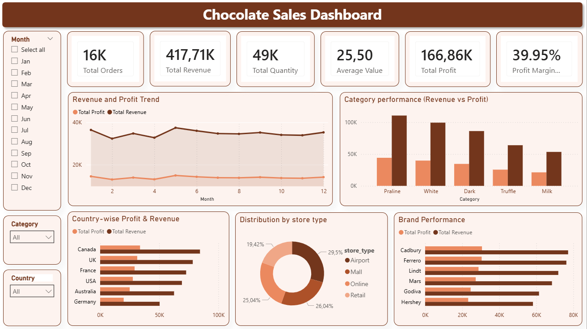

# 🍫 Chocolate Sales Dashboard

> An interactive Power BI dashboard uncovering revenue trends, profitability, and performance patterns across the chocolate retail landscape.



---

## 📊 Overview

This project delivers a multi-dimensional analysis of chocolate sales data, exploring performance across product categories, brands, countries, and store types. Built with a clean star schema and purpose-built DAX measures, the dashboard transforms raw sales data into actionable business intelligence.

---

## ✨ Key Features

| Feature | Description |
|---|---|
| 📈 **Revenue & Profit Trends** | Time-series analysis of sales and margin performance |
| 📦 **Category Breakdown** | Side-by-side comparison across chocolate product categories |
| 🌍 **Country Analysis** | Geographic revenue and profit distribution |
| 🏪 **Store Type Distribution** | Channel contribution to overall sales |
| 🏷️ **Brand Comparison** | Head-to-head brand performance ranking |
| 🎛️ **Interactive Slicers** | Dynamic filtering by Month, Category, and Country |

---

## 📌 Key Metrics

- **Total Revenue** — Overall sales generated across all channels
- **Total Profit** — Net earnings after costs
- **Total Orders** — Volume of transactions processed
- **Total Quantity Sold** — Units moved across all categories
- **Average Order Value** — Revenue per transaction
- **Profit Margin** — Efficiency of revenue conversion to profit

---

## 🧠 Insights

- **Praline** and **White Chocolate** categories lead in total revenue generation
- A consistent set of brands outperforms peers in both revenue and profit margin
- Monthly revenue remains relatively stable, with mild seasonal variation
- Specific store channels dominate overall sales volume
- Country-level patterns reveal meaningful geographic variation in both revenue and profitability

---

## ⚠️ Data Note

Customer-level analysis was intentionally excluded due to identifier inconsistencies across datasets. Only verified, matched data relationships were used to ensure the accuracy and reliability of all reported metrics.

---

## 🛠️ Tools & Techniques

- **Power BI Desktop** — Report authoring and visualisation
- **Data Modelling** — Star schema design for optimised querying
- **DAX** — Custom measures and calculated columns for KPIs

---

## 📁 Repository Structure

```
📦 chocolate-sales-dashboard
 ┣ 📊 Chocolate Sales Dashboard.pbix
 ┗ 📁 images
    ┗ 🖼️ dashboard.PNG
```

---

## 📬 Feedback & Contact

Have suggestions or questions? Feel free to open an issue or connect. Feedback is always welcome!
